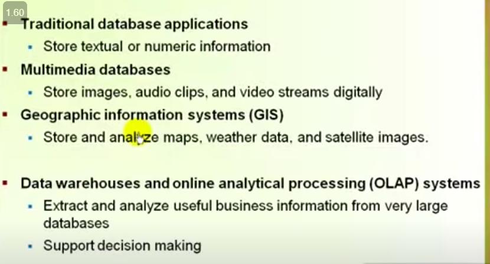
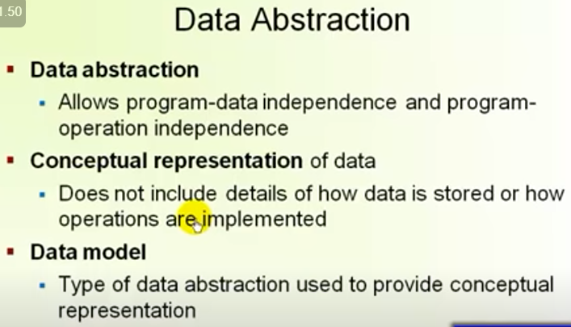
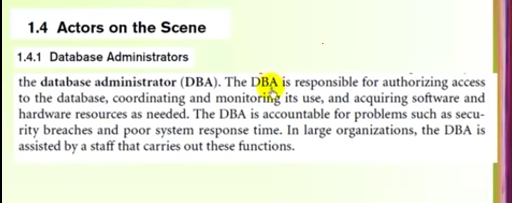
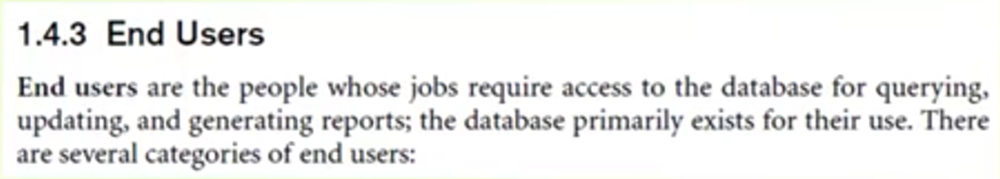

# Chapter 1

## What is Database?

is a collection of related data.
A database represents some aspect of the real world.

 

### Types Of DataBase

 

### Data management System (DBMS)

A database management system(DBMS) is a collection of programs that enables users to creat and maintain a database. The DBMS is a general-purpose   software system that facilitates the processes of defining , constructing ,mainipulating,and sharing DB among applications

1. ### Defining a database

   involves specifiyinh the data types,structures and constranints of the   data to be stored by the DBMS on the form of a database catalog or dictionary; it is called (meta-data).

1. ### Constructing the database =>

   is the process of storing the data on some storage medium that is controlled by the DBMS.  
   DBMS مرحلة تخزين البيانات فى وسط تخزين معين الذى تتحكم فيه ال

1. ### Manipulation a database =>

   inculdes functions such as querying the DB to retrieve specific data,  updating the DB to reflect changed in the mimiworld and generating reports from the data.

1. ### Sharing a database =>
   allow multiple users and programs to access the datavase simultaneously.

 

---

 

- An application program accesses the database by sending queries or request   for data to the DBMS.
   
- a query: causes some data to be retrieved.
   
- transaction : may cause some data to be read and some data to be written
  into database.
   
- provide a Protection :-
  system protection -> to the data against hardware or software malfunction
  security protection -> aganist unauthorized or malicious access.

---

 

### simplified DB system environment

.

## Disadvantages of File processing

- program-Data Dependence
- Duplication of Data
- Limited Data Sharing
- lengthy Development Times
- Excessive program Maintenance

---

## DataBase Approach

 

---

## Characteristics of the Database Approach

### 1. self-describing nature of a database system

### 2. insulation between programs and data, and data abstraction

### 3. support of multiple views of the data (depend on what user interest)

### 4. Sharing of data multiuser transaction processing

### What is transaction?

---

 

## Actors on the Scene

### 1. Database Administrators(DBA)

### 2. Database Designers

### 3. End Users

### 4. System Analysts and Application Programmers(Software Engineers)

