# Chapter 2

 

## 2.1 Data Models,Schemas , and Instances

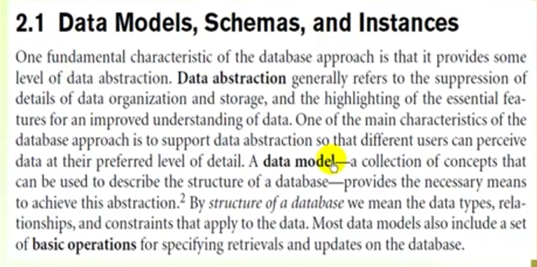

### 2.1.1 Categories of Data Models

They use to describe the database structure.   
**1. Hihg-level or conceptual data models** 
**2. low-level or physical data models**    
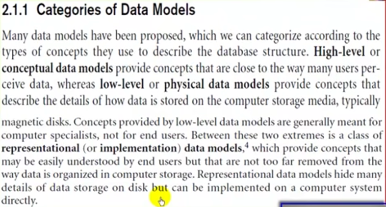  

---

- **A. Relational data model use concepts**  
  such as  
- entities  
- attributes  
- relationships    
  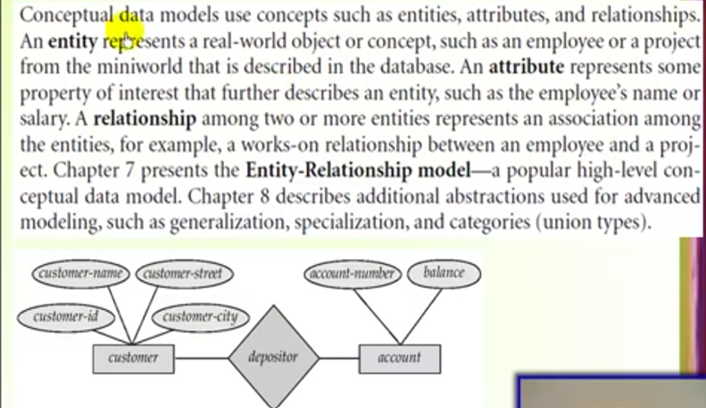
   

- That model is used **most frequently** in traditional commercial DBMSs.

 

- **B. physical data models**   
  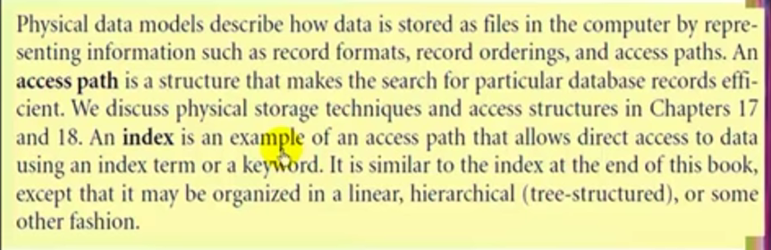

  ***

  

## 2.1.2 Schemas, Instances, and Database State

 

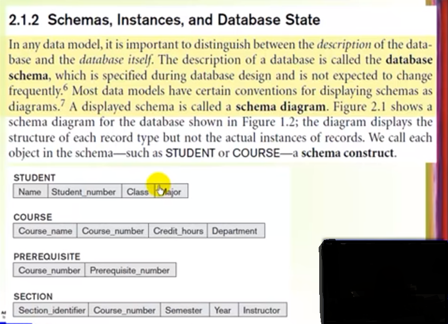
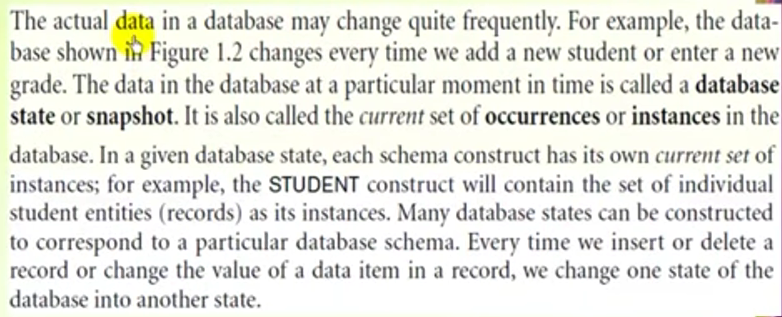

---

 

# 2.2 Three-Schema Architecture and Data Independence

 

## 2.2.1 Three-Schema Architecture

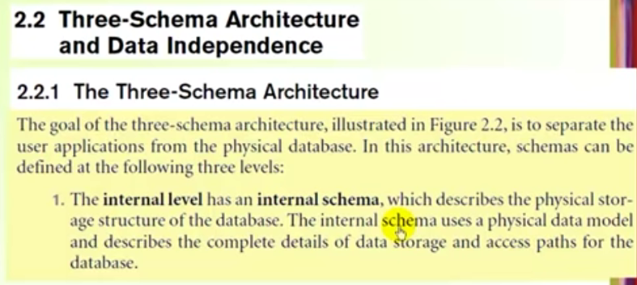
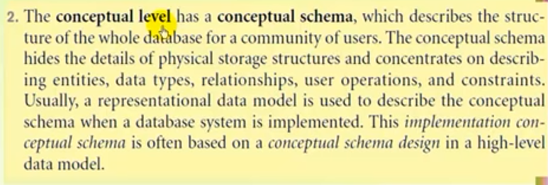
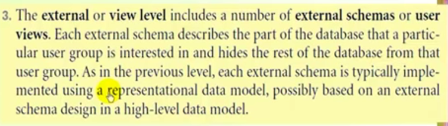
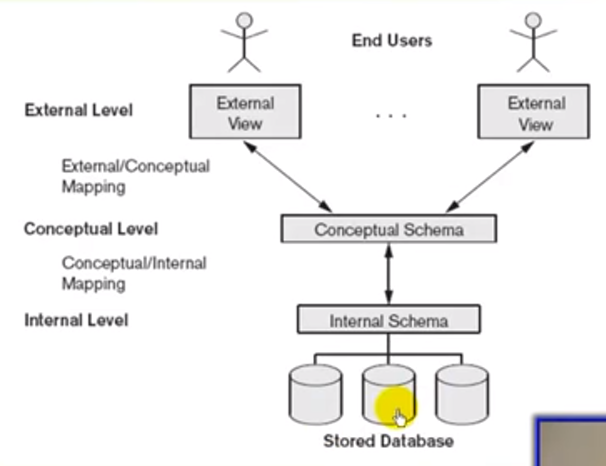

 

---

 

## 2.2.2 Data Independence

### A. Logical data independence

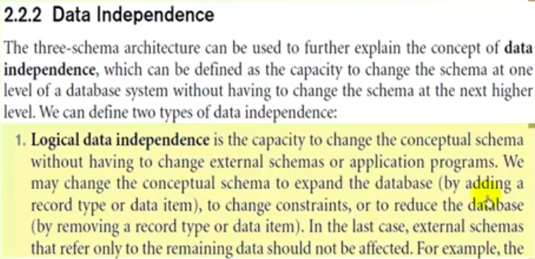

### B. physical data independence

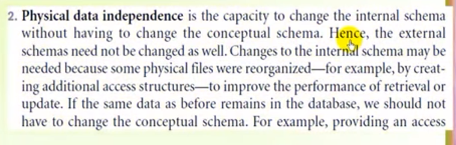

 

#### :Summary:

**Three-Schema Architecture and Data Independence**  

- Internal level
  - Describes physical storage structure of the database.
- Conceptual level
  - Describes structure of the whole database for a community of users.
- External or View level
  - Describes part of the database that a user group is interested in.

 

**Data Independence**

- Capacity to change the schema at one level of database system
  - without having to change the schema at the next higher level.

 

**Types**

- Logical
- Physical

---

   

# 2.3 Database Languages and Interfaces

 

---

 

# 2.4 The Database System Environment

## 2.4.1 DBMS Component Modules

**1. buffer mangement module**  
**2. higher-level stored data mangager module**   
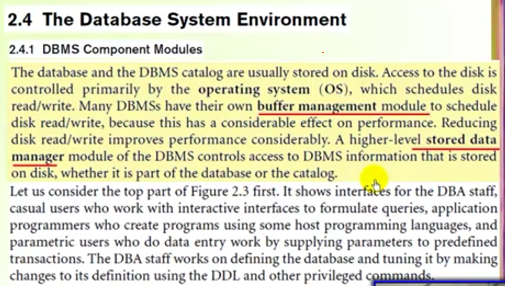
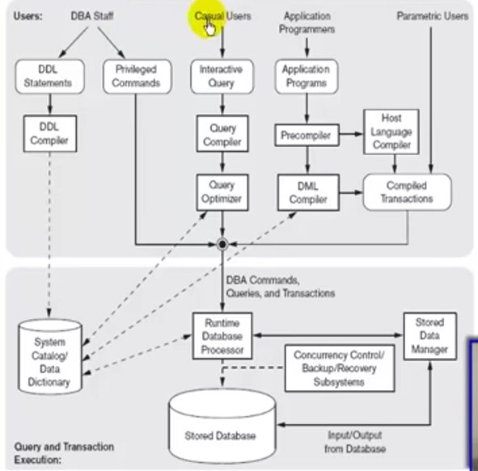

  

### top part of figure

- **Catalog and DDL compiler**  
  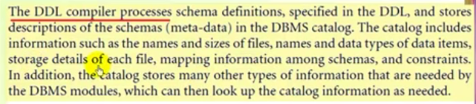

   

- **Casual users**  
  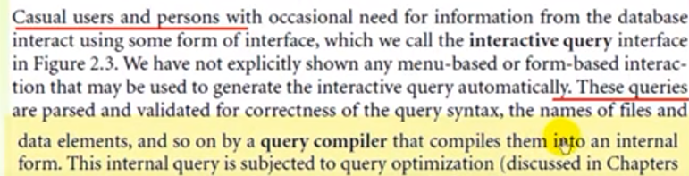
  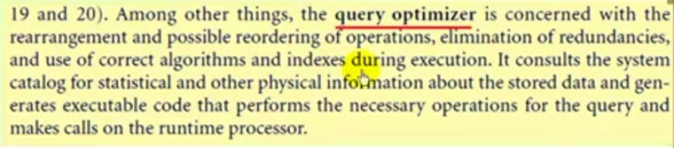

  

- **Application programmers**  
  

 

### lower part of the figure2.3

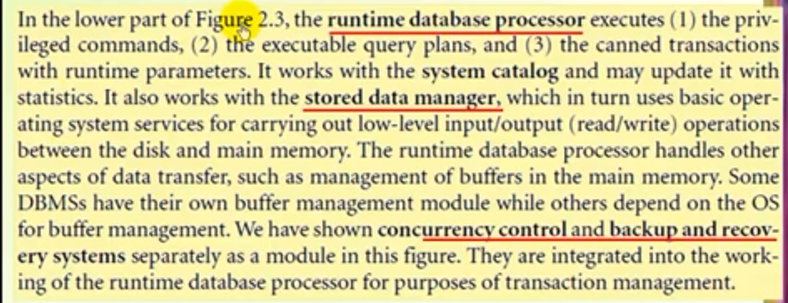

## 2.4.2 Database System Utilities (أداة مساعده)

**most DBMSs have database utilities that helps DBA manage the database system**

  

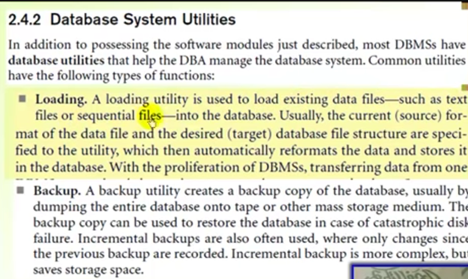
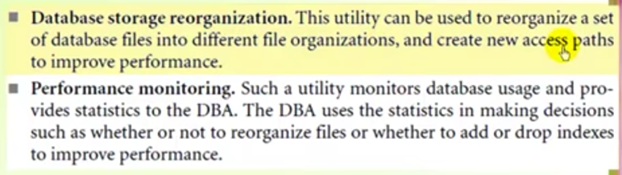

---

   

# 2.5 Centralized and Clinet/Server Architectures for DBMSs
(DBMSs هيكل او شكل بناء ال)

## 2.5.1 Centralized DBMSs Architectures
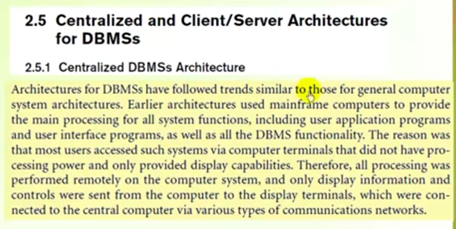
- this architecture used mainframe computers (huge computer has a great storage and processing) to provide the main processing for all system functions,   including user application programs and user interface programs, as well as **DBMS functionality**.

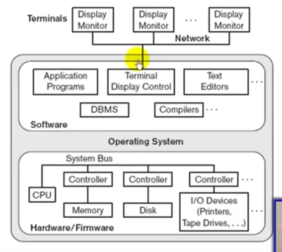

 

--- 

## 2.5.2 Basic Client/Server Architectures
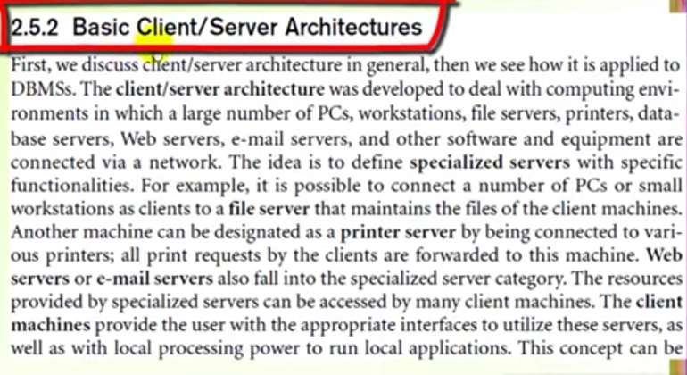

 - ### Client/Server Architectures for DBMSs

## 2.5.3 Two-Tier Client/Server Architectures for DBMSs

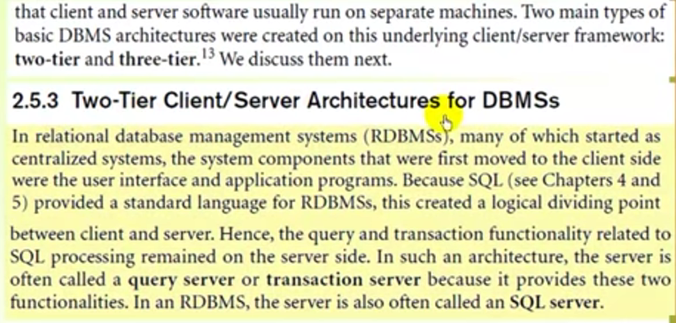
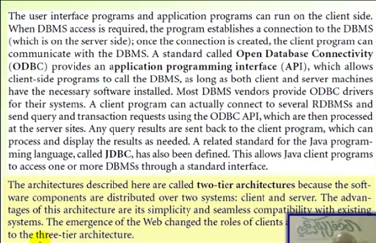

 

## 2.5.3 Three-Tier Architectures for Web Applications
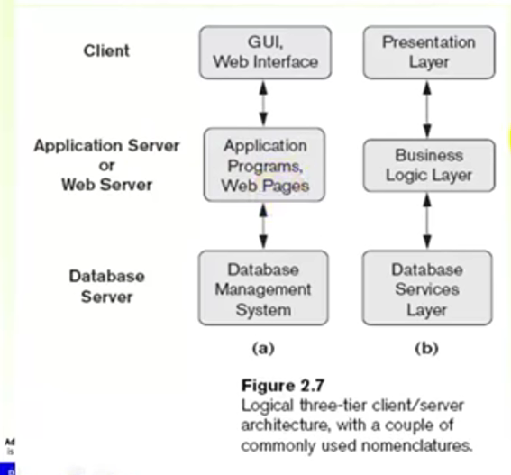

- **any updates on two-tier should be done at all clients and that take time , but at at three-tier any updates will be done once at the middle layer and that save a lot of time.** and that give us a security layer 