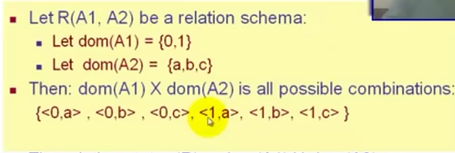
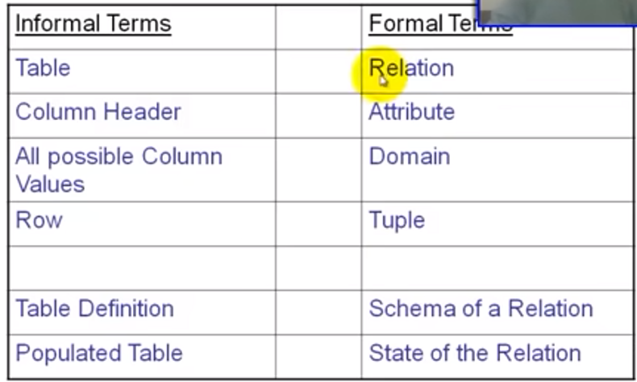
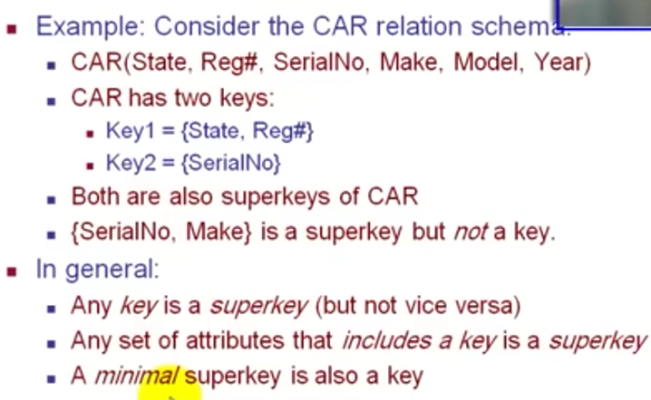
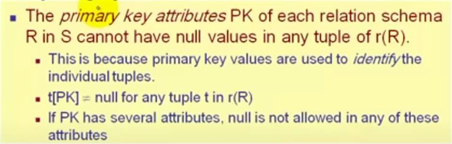
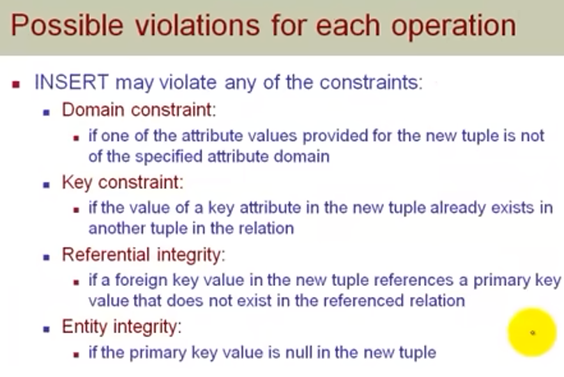

# Chapter 5

# The Relational Data Model & Relational Database Constraints

- It is an ( **implementaion or representation data model** ) **Intermediate level**  
  between the high-level(conceptual data model) and the low-level(physical data model).

---
---

## Relational Model Consepts

- The relational model of data is based on the concept of a Relation(table).
- A relation is a mathematical concept based on the ideas of sets.

--- 
   

- # Informal Definitions 
    - a **relation** looks like a **table** of values.
    - a relation contains a set of rows.
    - the data elements in each row represent certain facts that correspond to a real-world entity or relationship.
        - in formal model, rows are called **tuples**.
    - Each column has a column header that gives an indication of the meaning of data items in that column  
        - in formal model, column header is called an attribute(field).
        
- EXAMPLE OF A RELATION

- Key of a Relation:
    - Each row has a value of a data item (or ser of items)  
      that **uniquely** identifies that row in the table.

 

- # Formal Definitions 

- ### Schema
    - R(A1,A2,....,An) is the schema of the relation.
    - R is the name of the relation.
    - A1,A2,...,An are the **Attributes** of the relation.
- Each attribute has **domain** (constraint): set of valid values.
- a domain also has a data-type or a format defiened for it.
- ### State
    - it is one of the possible combinations of the result of product of all domain 
    - EXample:
    
    - r(R): a specific state of the relation R - this is a set of tuples(rows).
- ## Summary

--- 

# Relatoinal Integrity Constraints (Buseness role)
- Constraints are **conditions** that must hold on all valid relation states.

- **Types of constraints**
    - Key constraints
    - Entity integrity constranits
    - Referential integrity constraints

- an implicit constraint is the domain constraint.
    - every value in the tuple must be from the domain  
    or it could be **null**, if allowed for that attribute.

## 1.Key Constraints
attribute have a **unique** value.

- superkey of Relation(table)
    - is a set of attributes SK of R with the following condition:
        - no two tuples in any valid relation state r(R) will have the same value for SK
        

- Key of Relation
    - A "minimal" superkey : that mean that i can't remove any attributes form it.

- **EXample**

- ### primary key 
    - Unique identify each tuple in a relation.
    - Underlined.
    - not Null.
    - Also used to reference the tuple from another tuple

  

- ## Relational Database Schema
    - a set S of relation schemas that belong to the same database.
    - S is the name of the whole database schema
    - S={R1,R2,...,Rn}
    - R1,R2,Rn are names of relation schemas.

 

--- 

## 2. Entity Integrity Constraints

 

--- 
 
## 3. Referential Integrity Constraints
- A Constraint involving **two** relations
    - the previous constraints involve a single relation.
- used to specigy a **RelationShip** among tuples two relations: 
    - the **referencing relation** and the **referenced relation**.
    - **foreign key** in a table is a **primary key** in another table.
    - a row t1 in R1 is said to reference a row t2 in R2 if
    t1[FK] = t2[PK].

- value in foreign key column:
    1. one value from primary key which refers to it.
    1. a **NULL**
        - in case 2 , the FK should not be a part of its own primary key.

 

---

 

- by default you can not delete a parent table that has a child

- **Update** may violate domain constraint and NOT NULL constraint on an attribute being modified.

- Any of the other constraints may also be violated depending on the attribute being update:
    - **Update the primary Key (PK)**
        - can't be updated by NULL.
        - can't be updated by an already exist value.
    - **Update a foreign Key (FK)**
        - can't be updated by a value not exist in primary key(referential integrity).
    - **Update an ordinary attribute**
        - can also violate domain constraints.